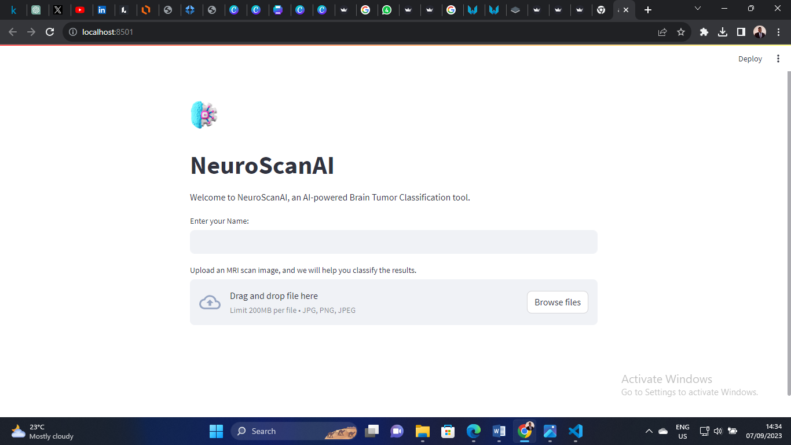
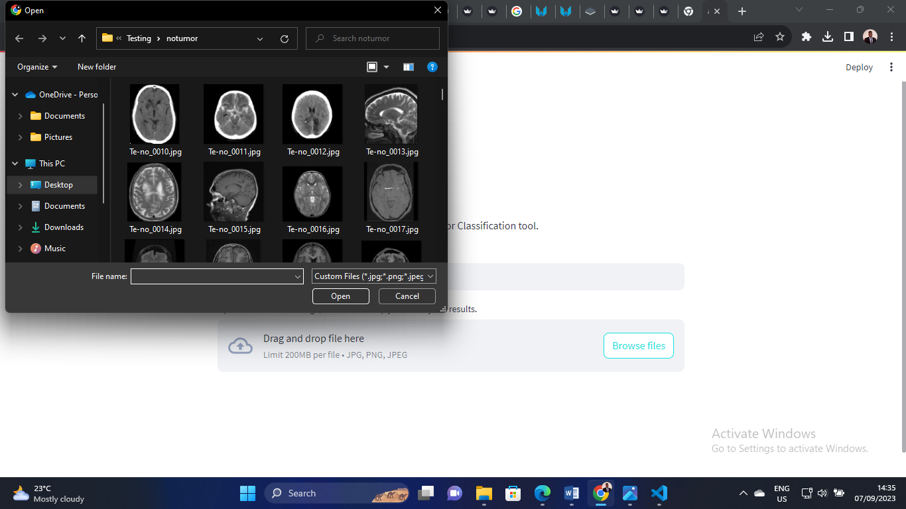
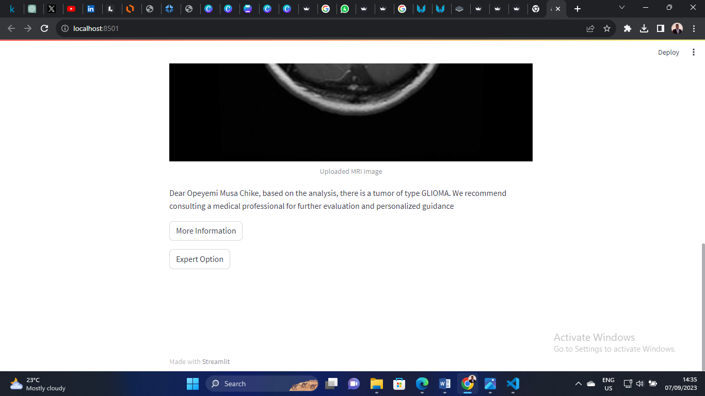
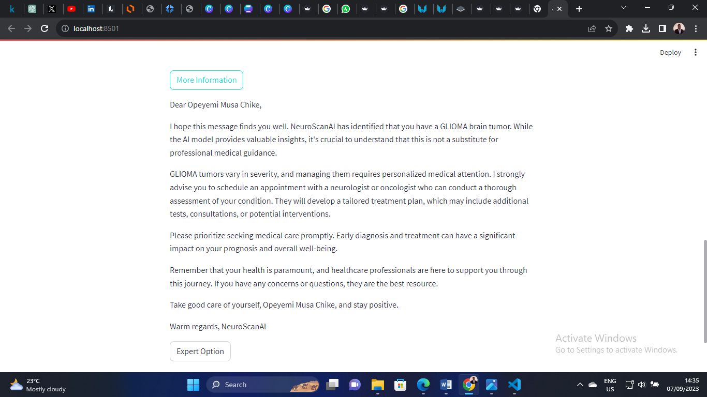
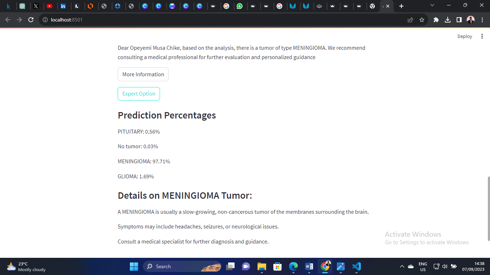

# NeuroScan Project

## Project Description

The NeuroScan project aims to develop a brain tumor classification system using machine learning, particularly Convolutional Neural Networks (CNNs). The goal is to improve the accuracy, accessibility, and speed of brain tumor diagnosis, especially in regions with limited medical resources. The project leverages Magnetic Resonance Imaging (MRI) scans as input data to classify brain tumors into four categories: glioma, meningioma, pituitary tumor, and no tumor.

## Data Source

The project uses the Brain Tumor Classification dataset available on Kaggle. You can find the dataset and additional information [here](https://www.kaggle.com/sartajbhuvaji/brain-tumor-classification-mri).

## Tools Used

The project employs a range of tools and technologies, including:

- **Python**: The primary programming language for data processing, model development, and result analysis.

- **Machine Learning Libraries**: TensorFlow and Keras for building and training CNN models.

- **Data Preprocessing**: Scikit-learn and OpenCV for preparing MRI scan data for model input.

- **Web Application**: Streamlit for creating a user-friendly web interface.

- **Model Evaluation**: Scikit-learn for generating classification reports, including metrics like precision, recall, F1-score, and accuracy.

## ML Model Results

The project evaluates two CNN models, one with transfer learning using the VGG16 architecture and the other developed from scratch. Here are the classification reports for each model:

**Model with VGG16 Transfer Learning:**

```
                  precision    recall  f1-score   support

           glioma       0.99      0.95      0.97       300
       meningioma       0.96      0.96      0.96       306
          notumor       1.00      1.00      1.00       405
        pituitary       0.96      0.99      0.98       300

        accuracy                           0.98      1311
       macro avg       0.98      0.98      0.98      1311
    weighted avg       0.98      0.98      0.98      1311
```

**Model without Transfer Learning:**

```
                  precision    recall  f1-score   support

           glioma       0.97      0.65      0.78       300
```

You can find the complete Kaggle notebook detailing the project and its implementation [here](https://www.kaggle.com/code/franklycypher/neuroscanai-model-building).

Feel free to explore the dataset, code, and results on Kaggle for a more in-depth understanding of the NeuroScan project.

## Model Usage and Deployment

### Overview
This section outlines how to utilize and deploy the model using Streamlit, a Python library for creating interactive web applications. The deployment process enables easy sharing and interaction with the model through a web-based interface.

## App Usage Images
Here are some sample images showcasing the app's usage:

1.  - *This is the Home page of the Application as Launched*
2.  - *After Launch is sucessful, The User will upload the MRI Scan to NeuroscanAI*
3.  - *NeuroScanAI will analyze the image and provide a Recommendation*
4.  - *The User can also get a Detailed Responses as to the type of tumour*
5.  - *The Application can also provide prediction confidence levels*

